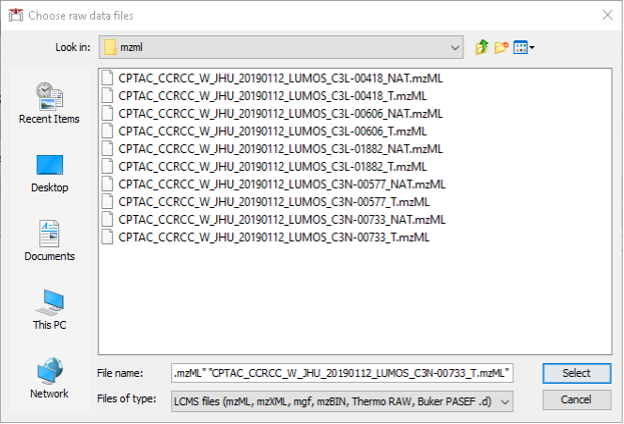
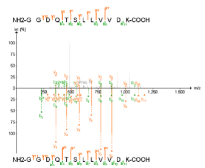
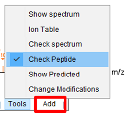

## Untargeted analysis of DIA datasets using FragPipe

This is the first part of two parts tutorial of an untargeted analysis of a data-independent acquisition (DIA) dataset using the FragPipe computational platform. We will analyse a subset of samples from a published clear cell renal cell carcinoma (ccRCC) study that were originally described in the following publication: D. J. Clark et al. “Integrated Proteogenomic Characterization of Clear Cell Renal Cell Carcinoma”, Cell 2019 179(4):964-983. doi: 10.1016/j.cell.2019.10.007 (https://pubmed.ncbi.nlm.nih.gov/31675502/). Briefly, in the original study, researchers from the CPTAC (Clinical Proteomic Tumor Analysis Consortium) profiled tumor (T) samples, together with normal adjacent tissue (NAT) samples from each cancer patient, to understand the tumorigenesis of ccRCC. 110 tumor and 83 NAT samples were collected from patients and their proteomes were profiled via mass spectrometry. These samples were profiled using: 1. tandem mass tag (TMT), and 2. data-independent acquisition (DIA). The DIA set was generated on an Orbitrap Lumos mass spectrometer with a variable window acquisition scheme.

Here, we will use just 10 DIA runs from 5 ccRCC patients, one tumor and one paired NAT sample for each patient. To make the data processing faster, we will use only data in two isolation windows (613 to 650 Th mass range) from each original mzML file.

We will use FragPipe for these analyses, a suite of computational tools with a Graphical User Interface (GUI) for enabling comprehensive analysis of mass spectrometry-based proteomics data. It is powered by MSFragger, an ultrafast proteomic search engine suitable for both conventional and open (wide precursor mass tolerance) peptide identification. FragPipe includes Percolator as well as the Philosopher toolkit for downstream statistical post-processing of MSFragger search results (PeptideProphet, iProphet, ProteinProphet), FDR filtering, and multi-experiment summary report generation. The software is well documented (https://fragpipe.nesvilab.org/). The FragPipe DIA workflow used in this tutorial is described in F. Yu et al. "Analysis of DIA proteomics data using MSFragger-DIA and FragPipe computational platform". Nature Communications 2023, 14(1), 4154.

In this tutorial, we will first process the data with MSFragger-DIA to identify peptides directly from the DIA data, then rescore the search results with MSBooster and Percolator, apply FDR filters, build the spectral library using Easy-PQP, and finally pass the FragPipe-build spectral library to DIA-NN to extract peptide quantification. Once we get the identification and quantification results from FragPipe, we will load them in FragPipe-PDV to visualize the identifications, and we will perform some downstream analysis using FragPipe-Analyst. Finally, we will learn how to load the raw data in Skyline to see the extracted ion chromatograms for each of the identified peptides.

### Parametrization of FragPipe graphical user interfase

In this first part of the tutorial we will set up the graphical user interface of FragPipe and launch a library-free (direct DIA) search of DIA data with MSFragger-DIA, followed by spectral librray building, and quantification with DIA-NN. The end result of this part will be the generation of a collection of matrices with the quantification values at the precursor and protein levels, as well as a summary pdf file of the experiment. Here we use FragPipe 20.1-build15 as an example:

- Go to `Fragpipe\tools\Fragpipe-20.1-build15\fragpipe\bin`
- Click in the `fragpipe.exe` icon to open the graphical user interface.

#### Parametrization of the Config section

In this section we need to make sure that all the different tools that are required by FragPipe are installed in the system and provide FragPipe with the path to the corresponding executables.

- Select the `Config tab` from the graphical user interfase of FragPipe.
- Go to the MSFragger section below and click `Browse`. Navigate to `Fragpipe\tools\MSFragger-3.8\MSFragger-3.8` and select the `MSFragger-3.8.jar` executable.

- Go to the IonQuant section below and click `Browse`. Navigate to `Fragpipe\tools\` and select the `IonQuant-1.9.8.jar` executable.

- Go to the Philosopher section below and click `Browse`. Navigate to `Fragpipe\tools\` and select the `philosopher-v5.1.0-RC7.exe` executable.

- Go to the DIA-NN section below and click `Browse`. Navigate to `fragpipe\tools\diann\1.8.2_beta_8\win` and select the `DIA-NN.exe` executable.

- Go to the Python section below and click `Browse`. Navigate to `Fragpipe\tools\` and select the `python-3.9.13-amd64` installer.

After the installer is finished installing Python, the path should be automatically updated to “C:\Users\[your user]\AppData\Local\Programs\Python\Python39\python.exe”. Otherwise, customize the path to python to your local installation.

- Go to the `Spectral Library Generation` section in the bottom and click `Install/Upgrade EasyPQP`. Wait until the installation of this python module is finished.

Now your `Config` should look like this:

#### Parametrization of the Workflow section

FragPipe supports multiple proteomics workflows which can be customized, saved and shared with other users. 

In the Workflow tab:

- Choose the workflow “DIA_SpecLib_Quant” workflows, which corresponds to the DIA spectral library generation and quantification using DIA-NN.
- Press “Load workflow” to load the parameters of the selected workflow.
- In the Global settings, set the amount of RAM memory to zero. A RAM setting of 0 will allow FragPipe to automatically detect available memory and allocate a safe amount.
- In the “Parallelism” you can select the number of logical cores to use. Set this to the number of cores that your computer has minus one.
- In “Input LC-MS Files” section we will load and annotated all the mzML files that contain the raw data acquired in the aforementioned experiment.
  - Check “Regular MS”. Note that the option ‘IM-MS’ is meant only for Bruker timsTOF PASEF data whereas ‘Regular MS’ is meant for all other data types (including FAIMS).
  - Click “Add files” and navigate to location of your mzML files. Here, we select the 10 mzML files of ccRCC downloaded from [PDC](https://proteomic.datacommons.cancer.gov/pdc/). Then, click “Select”.

  

  - Now we need to annotate the Experiment and the Bioreplicate associated to each raw file according to sample information.
    - For each file (row) select “Set experiment” and type the condition “NAT” or “T”. Note that one can select multiple rows with the “Control” key and annotate them simultaneously.
    - For each file (row) select “Set Bioreplicate” and type the condition 1 to 5. Note that the two conditions are always paired as they come from the same individual, and therefore, for each pair, we need to set the same bioreplicate number.
    - The resulting table should look like this:

  

#### Parametrization of the Database section

We will skip the Umpire tab as it is not meant to be executed in the selected workflow, and move directly to the Database tab.

- Click “Download” to retrieve a fresh UniProt human database including reviewed sequences only, plus contaminants and decoys.

- Save the fasta file into any location of preference. THe path will be recorded and directly inserted the corresponding field in the FragPipe GUI.

#### Parametrization of the MSFragger section

In the MSFragger tab you can check the search parameters that will be used to interpret the acquired spectra our analysis. The parameters have already been filled with the default values associated to the workflow selected. Let’s review them.

- In Peak Matching part, the precursor and fragment mass tolerances are specified. In this case, it is set to 20 ppm, which is the standard in a so-called closed data search using data acquired in a high-resolution mass spectrometry analyzer. Options on whether there is the need for automatic mass calibration, parameter optimization and isotope peak selection correction are also present.
- In Protein Digestion part, we define that an enzymatic digestion was used to prepare the sample, and that trypsin was the enzyme used. The range of peptide length and mass are also specified. All these parameters are important when interpreting the spectra in silico because they define the set of potential peptides that can be present in the sample.
- Note: Calibration and Optimization is set by default to “Mass Calibration, Parameter Optimization”. This option will effectively perform multiple simplified MSFragger searches with different parameters to find the optimal settings for your data. In practice, it results in 5-10% improvement in the number of identified PSMs at the expense of increased analysis time. To save time, you can consider changing this option to “Mass Calibration” or even “None”, especially if you already know your data (e.g. from previous searches of the same or similar files) and can adjust the corresponding MSFragger parameters (fragment tolerance, number of peaks used, intensity transformation) manually, if needed.
- In Modifications part, both variable and fixed modifications that can be found in the analysed peptides are specified, as well as the maximum number of allowed modifications per peptide and the maximum number of occurrences per single modification.

- Finally, there is the section of Advanced Options, which includes parameters for Spectral Processing that determine how many spectral peaks are taken into consideration. It also includes the Advanced Output Options and Advances Peak Matching Options that define the number of top N peptides to use for quantification, the output format, the fragment ion series, fragment charge range and minimum number of matched fragments to be considered during the search.

You can choose to save a customized parameter file to load for future use, or save the entire workflow (from either the ‘Workflow’ or the ‘Run’ tab).

#### Parametrization of the Validation section

The Validation section will also be executed as part of the selected workflow. The search results obtained from MSFragger will be further analyzed by MSBooster, Percolator and ProteinProphet to get confident peptide identifications.

In this process, MSBooster will first use deep learning to predict additional features of the identified peptides including fragmentation spectra, retention time, and detectability (and ion mobility).

These features will be used to modify the initial identification scoring, and then Percolator will use them to improve its discrimination model to increase the number of confident identifications in the DIA dataset.

Finally, based on the identified peptides we will run the Protein Inference together with ProteinProphet to generate a confident list of protein groups identified in the sample at a maximum of 1% false discovery rate.

#### Parametrization of the Spec Lib section

Next, we will jump directly to the Spec Lib tab as the other ones (PTMs, Glyco, Quant (MS1), and Quant (isobaric)) are not relevant for the selected workflow and will not be executed. In the Spec Lib section we will generate a spectral library from the search results, containing b and y fragment ions, and we will allow for an automatic selection of the runs that will be used as reference for the retention time.

####  Parametrization of the Quant (DIA) section

In the Quant(DIA) section we will set the quantification to be performed by DIA-NN with a maximum false discovery rate of 1%. In this section, we will also verify that the “Generate MSstats input” is checked.

#### Parametrization of the Run section

In this final section, we will indicate the output directory and run the analysis.

- Create a new folder in the place you want to save result and call it `output` and set is as the output directory of the results in FragPipe GUI.
- Click “RUN”. The analysis will now be launched and it will take about 10-20 minutes. Once finished, do not close the FragPipe window. We will need it later to visualize the results.

### Exploration of the FragPipe main results tables

In this part of the tutorial we will go through the main results tables generated by FragPipe and some of its intermediate files.

#### Inspection of the FragPipe main output

- Go to `output` folder and locate the “diann-output” folder that has been generated by FragPipe.
- Inside the “diann-output” folder, locate the report.pg_matrix.tsv file and open it in Excel to inspect the protein-level output from the DIA-NN quantification module. You will see columns with the information such as protein group identifiers, gene names, and intensities from DIA runs calculated with the MaxLFQ algorithm embedded in DIA-NN.

- In the same folder, now open the msstats.csv file. This file contains the information required for MSstats at the fragment level. Note that the information related to “Experiment” and “Bioreplicate” annotated in FragPipe is provided now to MSstats as the “Condition” column and the “BioReplicate” column, respectively. 
- Note: Msstats is an R package for statistical inference of proteomics data and can be accessed through the web at www.msstatsshiny.com. Kohler D, et al. MSstats Version 4.0: Statistical Analyses of Quantitative Mass Spectrometry-Based Proteomic Experiments with Chromatography-Based Quantification at Scale. J Proteome Res. 2023 May 5;22(5):1466-1482. doi: 10.1021/acs.jproteome.2c00834.

#### Inspection of intermediate FragPipe output files

If you are curious, you can explore FragPipe output files to get a better understanding of various FragPipe modules.

- Open the psm.tsv file with Excel and inspect the information that you have for each peptide-spectrum match. You will see the “SpectralSim” column, which indicates how well each PSM’s experimental fragment intensities match predicted intensities from the spectral prediction model; this is the ‘spectral entropy’ score, a value between 0 and 1, with 1 being a perfect match. You will also see the “RTScore”, which shows how much the experimental retention time of each PSM deviates from what is expected based on retention time predictions; the lower the value, the better. 
- Open now the .png files inside MSBooster_RTplots. Each of these files corresponds to a different mzML file and shows the calibration curve fit between the predicted iRT scale and the experimental RT from this experiment’s chromatography setup.
- Open the log file with a text editor or your Notepad. In this file you will find all the commands that have been executed by the FragPipe workflow. Note the mass correction values printed at the mass calibration step of MSFragger. Inspect also the Percolator weights. The greater the magnitude of the weights, the more influence that variable has in Percolator rescoring.
- Open the library.tsv file with Excel. This is the library files built using EasyPQP from PSM.tsv and mzML files, and contains peptide ions passing 1% protein-level, peptide-level, and PSM-level FDR. For precursors identified from multiple PSMs (in the same or different runs), fragment ion intensities and retention time (after alignment to the reference run) of the best scoring PSM are used. This file is used as input to DIA-NN for extracting quantification. 

### Visualization of the FragPipe main results

#### Visualization of identification results in FragPipe-PDV

In this section we will visualize the identification results from FragPipe at different levels, including experiments, proteins, peptides and PSM information.

- Go to the Run tab in the graphical user interfase of FragPipe and open FragPipe-PDV by clicking on ‘FragPipe-PDV viewer’ to open the results.

- A FragPipe-PDV viewer will open with five main panels including the information about the “Experiments”, “Protein coverage”, “Spectrum viewer with annotations”, “Table of identified proteins”, and the “Table with Peptide-Spectrum Matches (PSMs)”.

There are several functions embedded in FragPipe-PDV that we will explore. For example, one can look for certain peptide sequences or protein of interest.
    - Search the protein “CTNA1”, using the searching function located on the top right corner. How many PSMs are associated to this protein? How many different unique peptide sequences have been identified for this protein? What are their PeptideProphetProbabilities

In FragPipe-PDV you can also see the annotated spectra in which peptides were identified. FragPipe-PDV has several options to configure the settings for peptide spectra visualization.
    - Go to the “Tools” menu below the spectrum, click and select “Show Predicted” to show the predicted spectrum in a mirror spectra format. 

Why do you think spectra are populated with so many different unmatched peaks? Are they good identifications?
    - To clean the spectra, click “Show Matched Peaks” in the “Settings” menu to remove background peaks

Do the identifications look better now? Do you think that they are more credible?

Now we will see how different peptides can be identified in the same single MS2 spectrum. For this example, we will use one peptide SMEDSVDVSAPK from sp|Q8IVF2|AHNK2_HUMAN Protein. This is one of the ccRCC cancer biomarkers (overexpressed in tumor samples) that we will also use as an example later in this tutorial.

- Search for protein Q8IVF2 and find all peptides identified for this protein.
- Click on the peptide SMEDSVDVSAPK listed above to view its spectrum.
- Go to the Tutorial-5 folder and open the PSM.tsv file with Excel and look for the SMEDSVDVSAPK peptide. Note that the peptide has been identified twice, in two different spectra from two different raw files.
- Check the spectrum number for each of the identifications looking at the value of the first column.

- Now filter the `PSM.tsv` file by the spectrum column containing the spectrum “CPTAC_CCRCC_W_JHU_20190112_LUMOS_C3L-00418_T.01248.01248.0”. Notice that there is another peptide, TDYM[+16]VGSYGPR, that was identified in that same MS2 scan.

You can use the PDV viewer to visualize both peptides at the same time.
- Select “Check Peptide” function in the “Tools” menu to check different peptide matches on the current spectra.

- Click “Add” and type the sequence of the peptide that you want to add into the visualization. Enter the peptide sequence without modifications.

- Click amino acid to add a modification on it.

- Note: Remember than in “Settings” you can select to see either all peaks or only the matched peaks.

[Next: Downstream analysis using FragPipe-Analyst](README.md)
