## Downstream analysis of DIA data using FragPipe-Analyst

This is the second part of two parts tutorial of an untargeted analysis of a data-independent acquisition (DIA) dataset using the FragPipe computational tool collection. You can find the first part [here](DIA.md). In this section we will do a downstream analysis and visualization of the quantitative results of the obtained results with FragPipe-Analyst and we will perform a principal components analysis (PCA) and a statistical assessment of protein abundance changes.

- Go to the “Run” tab of the graphical user interface ofFragPipe and click in the FragPipe-Analyst button. Alternatively, you can also access FragPipe-Analyst directly in your browser at [http://fragpipe-analyst.nesvilab.org/](http://fragpipe-analyst.nesvilab.org/)

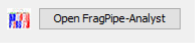

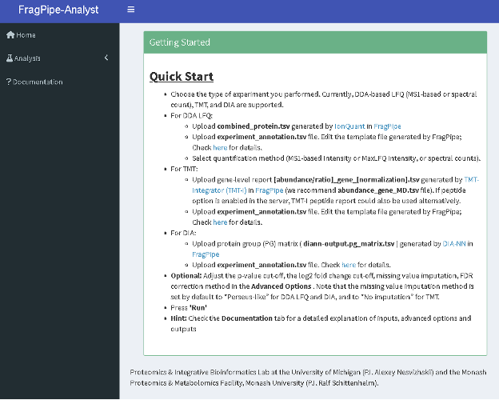

- Choose the Analysis option from the left-hand side menu and in the “Data type” dropdown menu, choose “DIA”.
- Follow the instruction on the left-hand side menu to upload report.pg_matrix.tsv and experiment_annotation.tsv.

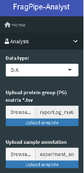

- Inspect the “Advanced Options” and review the values for the different sections.
  - Set the “Min percentage of non-missing values globally” to zero.
  - Set the “Min percentage of non-missing values in at least one condition“ to zero.
  - Set the “Adjusted p-value cutoff" to 0.01.
  - Set the “Log2 fold change cutoff” to 1.
  - Set the “Normalization type” to “No normalization”.
  - Set the “Imputation type” to Perseus-type
  - Set the “Type of FDR correction” to Benjamini Hochberg.

- Note: In the FragPipe-Analyst, a Perseus-like imputation is used by default and the imputed matrix will be used to perform differential expression analysis via Limma. In this type of imputation, missing values are replaced by random numbers drawn from a normal distribution with a width of 0.3 and down shift of 1.8.

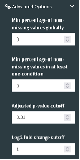
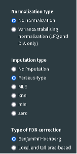

- Click the “Run” button located at the bottom of the page to start the downstream analysis. You should see your result shortly in the web interface.

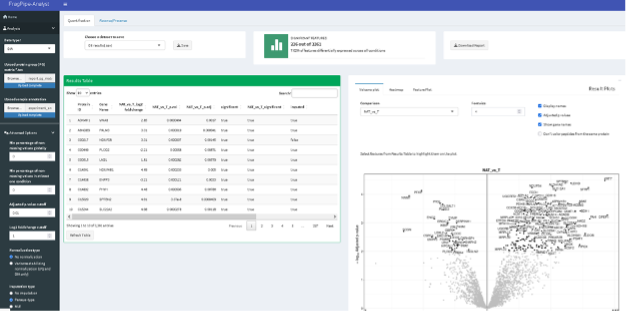

- The results include:
  - “Results Table” with the statistical assessment of between the different conditions indicated in the experimental design described in the experiment_annotation.tsv file.

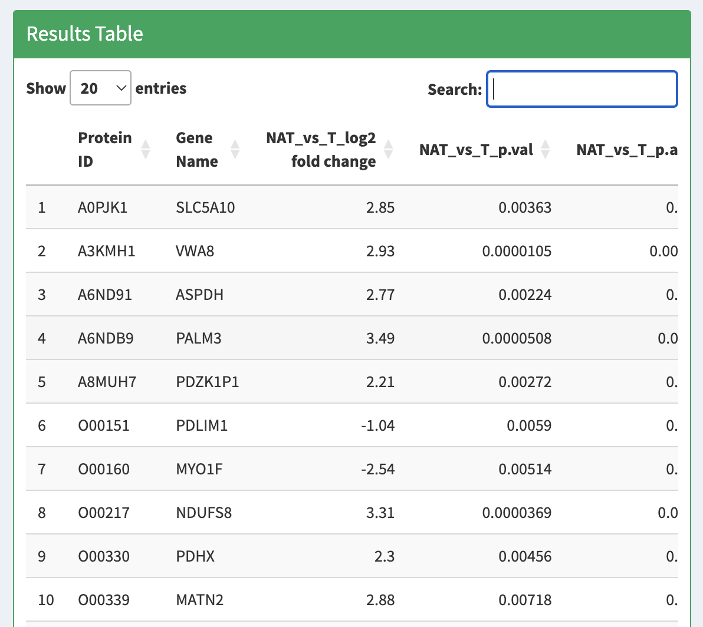

  - “Volcano Plot” displaying the protein fold-changes and adjusted p-values for the different comparisons.

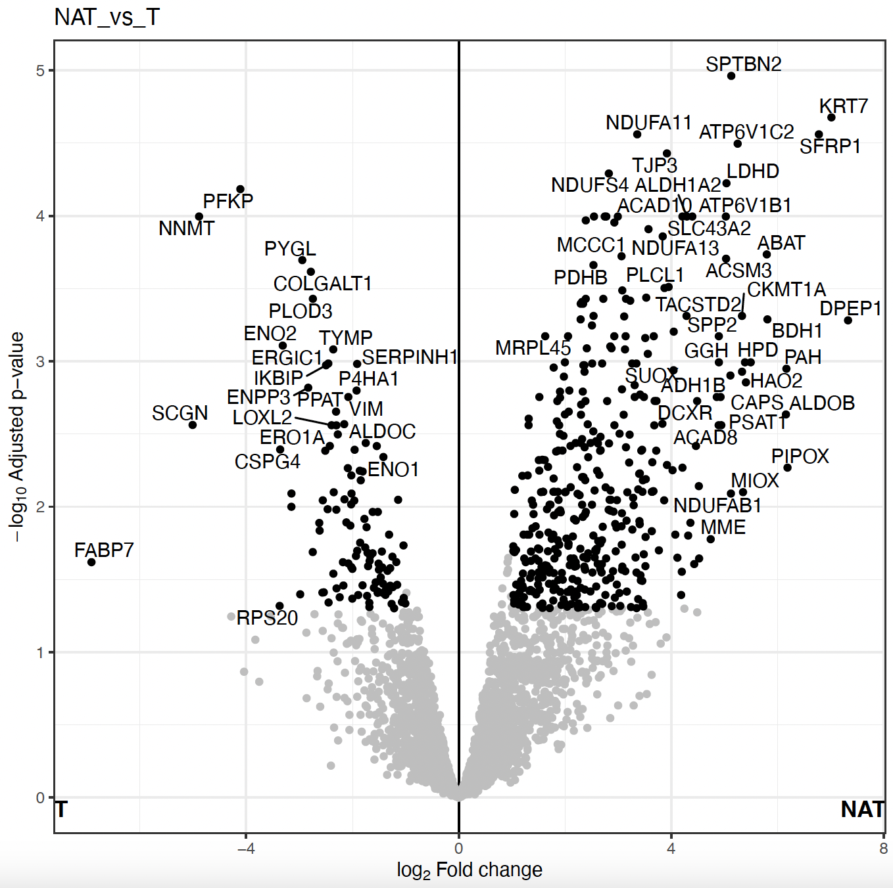

  - “Heatmap” for differetially expressed protein abundances in each individual sample with hierarchical clustering of the different conditions.

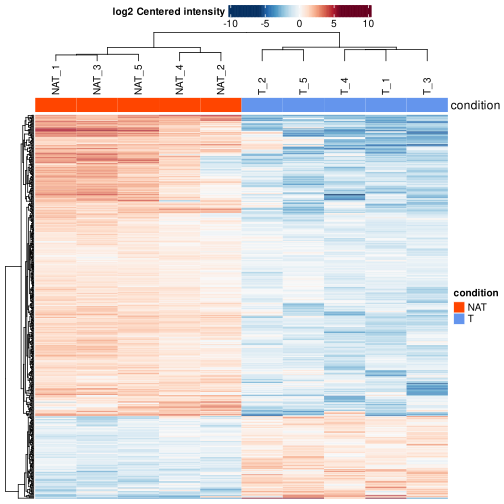

  - “Feature Plot”, displaying boxplots or violin plots of your favourite (selected) proteins from the Results Table. It could be visualized either imputed or non-imputed as well.

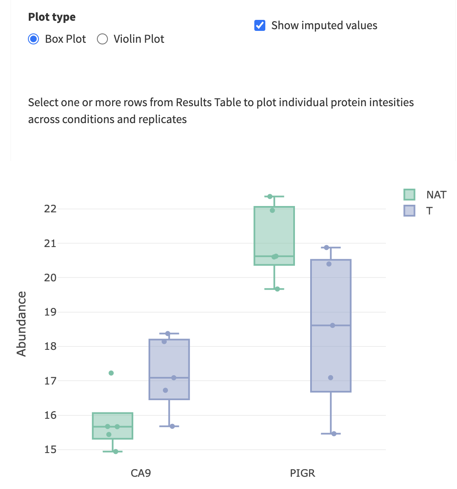

  - “PCA Plot” showing the result of the principal components analysis of the top 500 variable features.

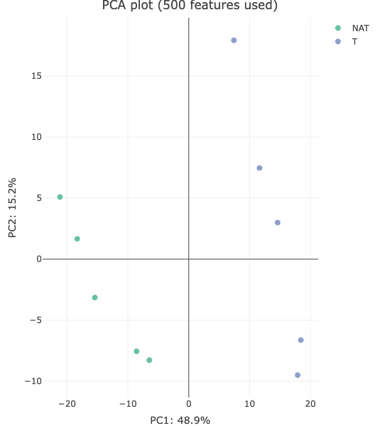

  - “Sample correlation plot” showing the Pearson correlation among the protein abundances matrix of the different samples.

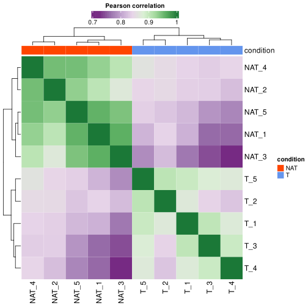

  - “Sample CVs” shows the distribution of the coefficient of variation of the different proteins among the replicates of each biological condition.

  - “Feature Numbers” shows the number of proteins used for the quantification in each sample.

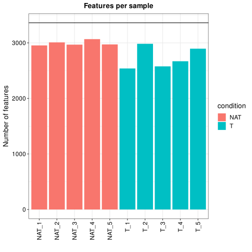

- “Sample coverage” shows the number of proteins that were found with valid quantitation values in all 10 samples, or only in 9 samples, 8, 7, etc.

- “Missing values - Heatmap” the distribution of missing values per protein and samples in the dataset.

- “Density plot” shows the distribution of protein abundances in the original data, in the filtered data, and in the set of proteins in which imputation was performed. In this case, the original data and the filtered data look the same as we did not force any filtering of the data in the “Advanced Options” of the Analysis section.

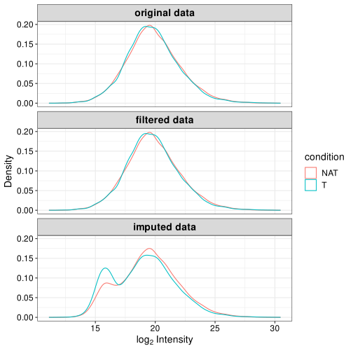

Normally, one can start with explorative analyses such as Principal Component Analysis (PCA) to see if the protein data exhibit tumor/normal difference. Following that, one can look for showing differential abundances in tumor samples compared to normal samples. Since the comparison is done for many proteins, multiple test correction is needed to control the false discovery rate. 

- Take your time now to explore the results, data and plots in FragPipe-Analyst. Once you have explored the different sections, try to answer the following questions:

- Do you think the proteome data exhibits any difference between tumor and normal? Inspect the PCA plot. What PC (principal component) captures the major differences between the protein expression profiles in tumor vs normal? How much of the total variance can be attributed to the difference between tumor and normal?

- Inspect quality control (QC) plots to see if there are any issues with the data (e.g., too few proteins identified in one of the runs, consistent differences in protein abundance distributions between samples, etc.). e.g. inspect “Sample Correlation” plot to see if there are any outliers. Inspect “Density Plot” to see protein abundance distributions before imputation, and after missing value imputation.

- Find and select a known cancer suppressor of kidney cancer, sFRP1. Find it on the volcano plot. Check its abundance levels across the tumor and normal samples in this dataset using “Feature Plot”. Select the protein in the “Results Table” to see the “Feature Plot”, and make sure to check the “Show imputed values” option.

- Note: When viewing volcano plots or doing enrichment analysis, pay special attention to which side represents which condition to correctly interpret the plots.

Once the statistical analysis is conducted we get a list of proteins with abundance values altered in between tumor and healthy tisses. However, it is often difficult to make sense of individual genes, especially when there are many of them. Enrichment analysis enables us to aggregate the evidence to biological pathway (Pathway enrichment) or processes (Gene Ontology) to gain a higher-level insight of tumor features.

- Go to the section “Pathway enrichment”. Select the “Hallmark” pathway database, check the “Up” direction, and click “Run Enrichment”. What are the most enrich pathways among the proteins in the “Up” direction?

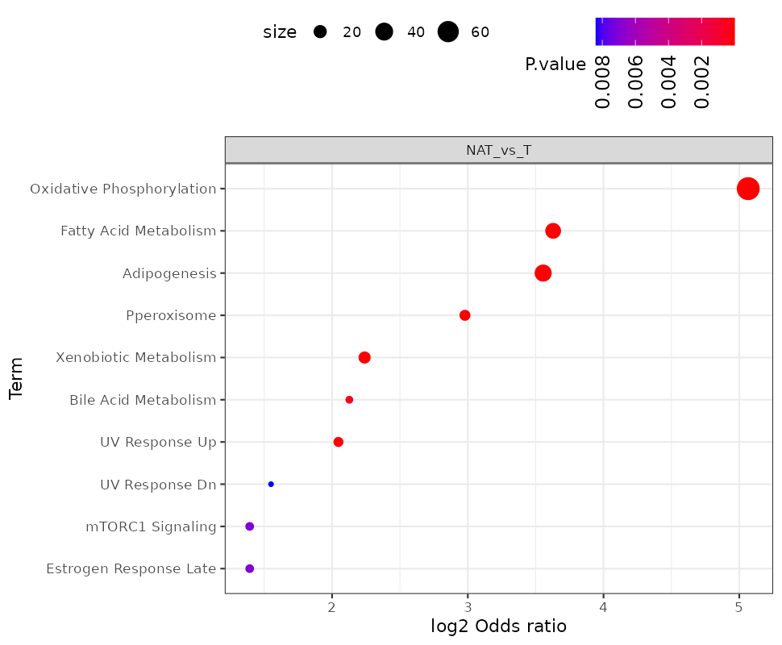

- Repeat the analysis using direction “Down”. What are the most enrich pathways among the proteins in the “Down” direction?

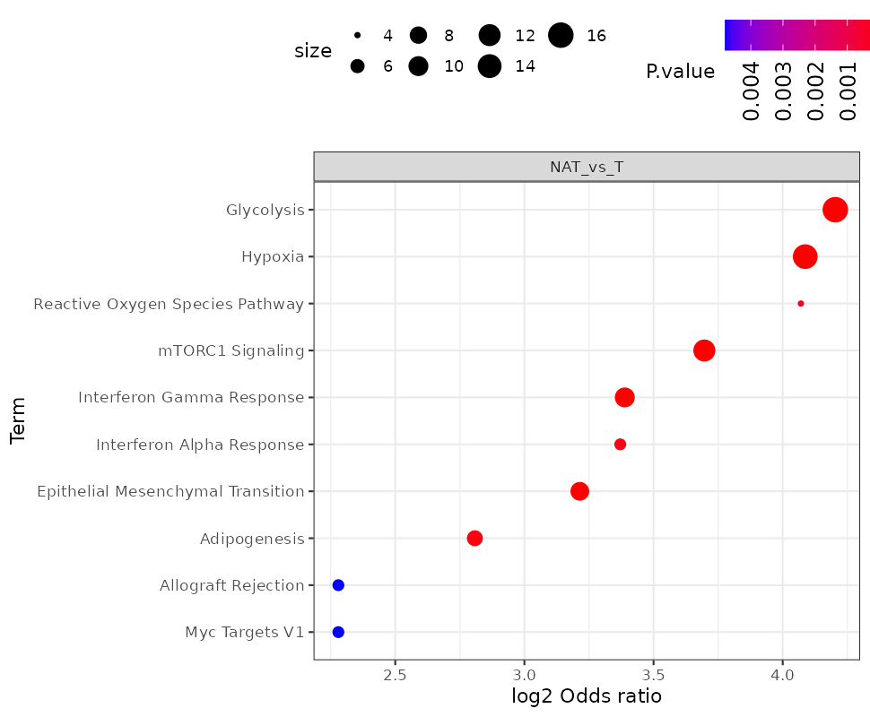

- Note: Currently the pathway enrichment can be done also with other databases like KEGG and Reactome, in addition to the Hallmark. However, at the moment the pathway enrichment analysis in FragPipe-Analysis only supports human data. In case you want to use any other external tool, you can download the results of the differential expression from FragPipe-Analyst by clicking on the “Save” button on the upper left corner and use in as input for other tools.

- Note: To get better agreement with the published results, you can change the “Adjusted p-value cutoff” in the Analysis “Advanced Options” section to 0.05 (from 0.01).

Finally, take into account that we are only using a very small fraction of the global proteome data from the original paper. Therefore, it is likely that you will see discrepancies between the analysis in this tutorial and the final results of the publication, including the number of proteins quantified, the proteins identified as showing a significant change in abundance, and the enriched pathways. However, it is noteworthy to highlight that even this very small dataset is capable of recovering many of the observations in the paper.