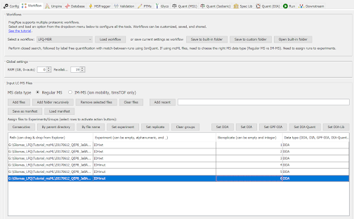

##  Untargeted analysis of LFQ datasets using FragPipe

For this part of the tutorial, we will be using a subset of a published dataset described in the following publication:
https://pubmed.ncbi.nlm.nih.gov/36584682/

J. Bader et al. “Proteomics separates adult-type diffuse high-grade gliomas in metabolic subgroups independent of 1p/19q codeletion and across IDH mutational status”, Cell Rep Med 2023 4(1):100877. doi: 10.1016/j.xcrm.2022.100877. 

In this study, researchers studied high-grade adult-type diffuse gliomas are malignant neuroepithelial tumors with poor survival rates in combined chemoradiotherapy. They used MS1-based label-free quantification (LFQ) mass spectrometry to characterize 42 formalin-fixed, paraffin-embedded (FFPE) samples from IDH-wild-type (IDHwt) gliomas, IDH-mutant (IDHmut) gliomas, and non-neoplastic controls. 

In this tutorial, we will use just 6 samples, 3 IDHmut and 3 IDHwt. We will use mzML files, although Raw files can be used instead. We will use the files listed below and they could be downloaded from [here](https://www.dropbox.com/sh/gf0owme9htg8n93/AADXdWAxEmwtjeORNnfqciXQa?dl=1):

| File     | Condition |
| -------- | ------- |
| 20170612_QEP8_JaBA_SA_LT01_V1_LC12_8_2FX2D1mS123fM2_sample11.mzML	| IDHmut |
| 20170612_QEP8_JaBA_SA_LT01_V1_LC12_8_2FX2D1mS123fM2_sample12.mzML	| IDHmut |
| 20170612_QEP8_JaBA_SA_LT01_V1_LC12_8_2FX2D1mS123fM2_sample13.mzML	| IDHmut |
| 20170612_QEP8_JaBA_SA_LT01_V1_LC12_8_2FX2D1mS123fM2_sample03.mzML	| IDHwt  |
| 20170612_QEP8_JaBA_SA_LT01_V1_LC12_8_2FX2D1mS123fM2_sample06.mzML	| IDHwt  |
| 20170612_QEP8_JaBA_SA_LT01_V1_LC12_8_2FX2D1mS123fM2_sample09.mzML	| IDHwt  |

In this tutorial, we will (1) process the data using FragPipe; (2) load the data in FragPipe-Analyst for downstream analysis; (3) FragPipe-generated msstats.tsv files will also be used in the second portion of the short course that focuses on MSstats.

### FragPipe analysis

- Open FragPipe GUI: Click on fragpipe.exe file located in D:\FragPipe_tools\Fragpipe_20.0\fragpipe\bin folder

### Configure the workflow

In the Workflow tab:
  - Select ‘LFQ-MBR’ (LFQ with match-between-runs) workflow and click ‘Load workflow’ 
  - Load and annotate the mzML file: 
  - Click on ‘Add files’. 
  - Select the 6 files listed above
  - Annotate files by putting conditions in the Experiment column (IDHmut or IDHwt) and label Bioreplicates sequentially (1...6). 

The resulting view of this tab will look like

### Configure the search (MSFragger)

In the MSFragger tab:

- To speed up the search, you can make these changes from the default:
Change ‘Calibration and Optimization’ to None

### Configure the validation

In the Validation tab:
You do not need to check the ‘Generate MSStats files’ box. In the LFQ-MBR workflow, msstats.csv files are created by default.

### Run FragPipe

In the Run tab, specify the output folder, and click on Run 

### Inspect FragPipe output

Inspect the protein-level output from the IonQuant quantification module: combined_protein.tsv file. Note the presence of Intensity (sum of peptide ion intensities to the protein level) and MaxLFQ Intensities. For proteome profiling experiments like the one used here we recommend using MaxLFQ values. On the other hand, for AP-MS ‘interactome’ and similar data, where comparison is done between very different samples (such as bait IP vs controls), we recommend using Intensity instead of MaxLFQ intensity. Spectral counts can also be used as quantification measures. 

Inspect msstats.csv (which contains precursor-level quantification from IonQuant).

Inspect experiment annotation file (for FragPipe-Analyst). Note there is no separate MSstats annotation file for MSstats when using LFQ workflows. 

### Notes

The tutorial was written as of FragPipe 15.2.